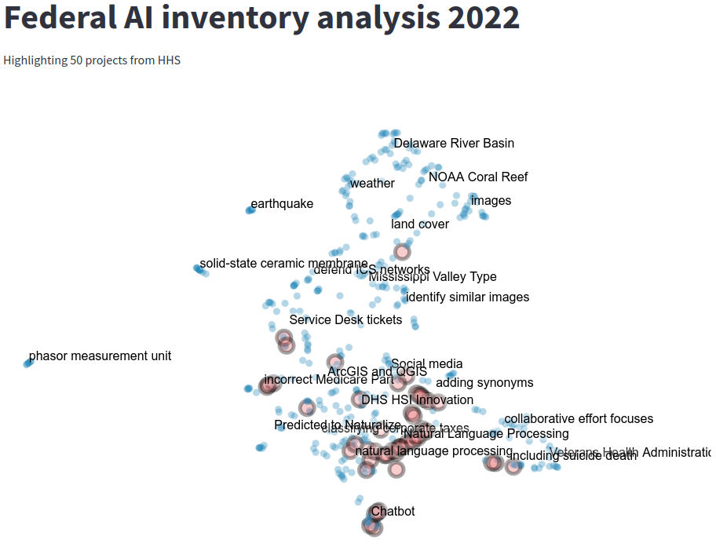

# Federal AI inventory analysis 2022
Analysis of the projects reported on the Federal inventory in 2022.

## Data collection

Projects were downloaded from the [AGENCY INVENTORIES OF AI USE CASES](https://www.ai.gov/ai-use-case-inventories/)

> Consistent with this principle of transparency, EO 13960 directed agencies to conduct an annual inventory of their AI use cases, and to publish them to the extent possible. As specified by EO 13960, agencies' inventories are not required to include AI use cases that are classified, sensitive, used in defense or national security systems, used by the Department of Defense or Intelligence Community, embedded within common commercial products, or used for AI research and development activities.

Each inventory was downloaded and saved to [data/department_org_src](data/department_org_src).
All data were collected on Aug 3rd, 2023 and may not reflect any updates on ai.gov.
Basic stats, information, and links can be found [here](data/high_level_stats_from_AI_gov.csv).

## Data preparation

Most Departments provided some form of machine readable table or easily parsed web version. Some only provided PDFs (HHS, Commerce, Energy, Treasury, Justice) and these required considerable human parsing along with a [custom script](P0_parse_pdf2table.py) using [Camelot](https://github.com/camelot-dev/camelot).

After manual parsing and cleanup the record level data was saved to [data/record_level_information_FedAI_2022.csv](data/record_level_information_FedAI_2022.csv)

+ `Department` (or independent agency name)
+ `Agency` (or bureau as appropriate)
+ `Office` (or center / division as appropriate)
+ `Title`
+ `Summary`
+ `Lifecycle` (optional, returned as provided)
+ `Contact Name` (optional, returned as provided)
+ `Contact Email` (optional, returned as provided)

Three records from the State Dept were dropped due to exact duplication across project Title and Summary.

## Natural Language Processing

A high powered LLM (in this case Chat GPT: gpt-3.5-turbo) is used to summarize each response as the quality of the summaries provided by the agencies is variable. For example, consider the response from the IRS and the associated summary:

> **Projected Contract Award Date Web App** Projected contract award dates are generated with a machine learning  model that statistically predicts when procurement requests will become  signed contracts. Input data includes funding information, date / time of  year, and individual Contract Specialist workload. The model outputs  projected contract award timeframes for specific procurement requests.   'When will a contract be signed?' is a key question for the IRS and  generally for the federal government. This tool gives insight about when  each request is likely to turn into a contract. The tool provides a technique  other federal agencies can implement, potentially affecting $600 billion in  government contracts. Weblink: https://www.irs.gov/newsroom/irs- announces-use-of-projected-contract-award-date-web-app-that-predicts- when-contracts-will-be-signed.

> The IRS has developed a web app that uses a machine learning model to predict when procurement requests will become signed contracts. The tool provides valuable insight for the IRS and other federal agencies on when contracts are likely to be signed, potentially impacting $600 billion in government contracts.


A high powered LLM (in this case Chat GPT: gpt-3.5-turbo) is used to summarize each response as the quality of the summaries provided by the agencies is variable. For example, consider the response from the IRS and the associated summary:

> **Projected Contract Award Date Web App** Projected contract award dates are generated with a machine learning  model that statistically predicts when procurement requests will become  signed contracts. Input data includes funding information, date / time of  year, and individual Contract Specialist workload. The model outputs  projected contract award timeframes for specific procurement requests.   'When will a contract be signed?' is a key question for the IRS and  generally for the federal government. This tool gives insight about when  each request is likely to turn into a contract. The tool provides a technique  other federal agencies can implement, potentially affecting $600 billion in  government contracts. Weblink: https://www.irs.gov/newsroom/irs- announces-use-of-projected-contract-award-date-web-app-that-predicts- when-contracts-will-be-signed.

> The IRS has developed a web app that uses a machine learning model to predict when procurement requests will become signed contracts. The tool provides valuable insight for the IRS and other federal agencies on when contracts are likely to be signed, potentially impacting $600 billion in government contracts.

Using the summarized response, we iteratively ask for a set of high level topics. The topics are human refined (human edits in parenthesis)

+ Artificial Intelligence in Healthcare (healthcare)
+ Data-driven approach using regional data and machine learning models (spatial)
+ Autonomous Maritime Awareness system (maritime)
+ Cyber Threat Intelligence Feed Correlation (cyber intelligence)
+ Security Operations with AI (security)
+ Environmental Monitoring with AI (environmental)
+ Prototype System for Global Audience Segmentation (customer service or engagement)
+ Power system resilience and grid operation (power systems)
+ Predictive maintenance and infrastructure monitoring (infrastructure)
+ Machine learning in various domains (dropped, generic)
+ Fraud Prevention System Prioritization (fraud)
+ Machine learning for wildfire damage assessment (dropped, small)

Each project was scored across the themes holistically by asking the LLM to return a JSON object. Observationally, this is a high recall medium precision task, so we further refined each positive response with an explanation of why the theme matched the project. By taking the final refinement step, about 25% of the projects were removed from their original theme.

|       | Theme                           | Projects |
|------------|---------------------------------|-------|
| 🔒         | security                        | 90    |
| 🏗️         | infrastructure                  | 72    |
| 🌍         | environmental                   | 66    |
| 🌍         | spatial                         | 63    |
| 🏥         | healthcare                      | 55    |
| 🔍         | cyber intelligence              | 25    |
| 🔌         | power systems                   | 24    |
| 🤝         | customer service or engagement  | 18    |
| 🌊         | maritime                        | 13    |
| 🕵️‍♂️       | fraud                           | 11    |
| 🔥         | wildfire                        | 1     |

The final results from the

## Visualization

To get a sense of the general clustering, each of the summarized projects were embedded through the latest OpenAI model (text-embedding-ada-002) and projected onto two dimensions using UMAP. A numpy array containing the embeddings is saved [here](data/GPT_embedding.npy). To interactively visualize the embeddings run `make streamlit`



## Costs calculation and data integrity 

Costs were calculated from a final run of the program, intermediate API calls during the exploration phase were not recorded.

```
Cost   : $0.79
Tokens : 393,474
Calls  : 1658
```

Each day, a github action is called to check the hash of the ai.gov source website. If the hash has not changed, then the data is up-to-date. If the hash has changed, some aspect of the website has been updated (though it may not reflect a change in the data). The daily hash is stored [here](data/ai_gov_md5hash.csv).